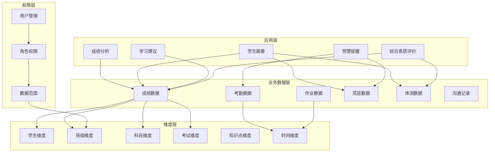
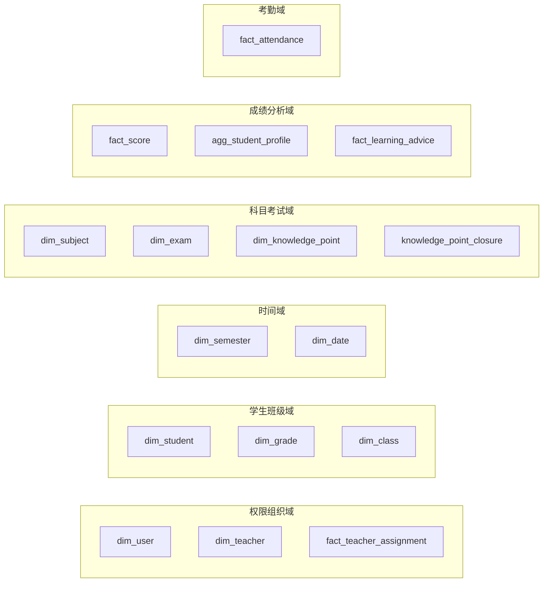
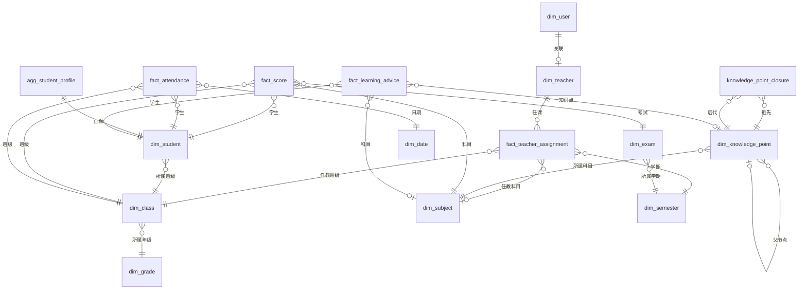
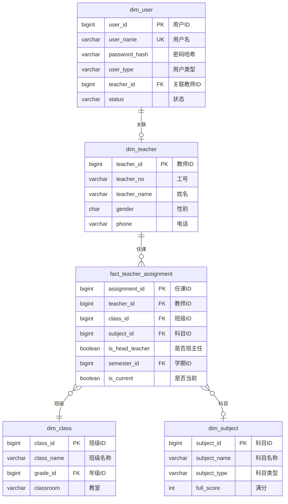
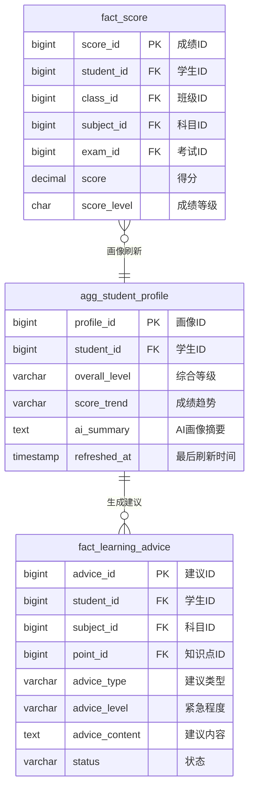
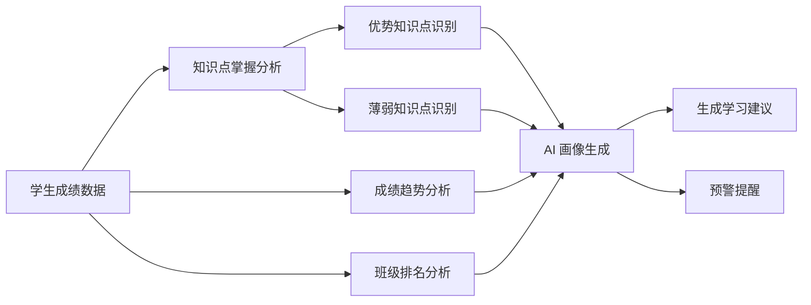
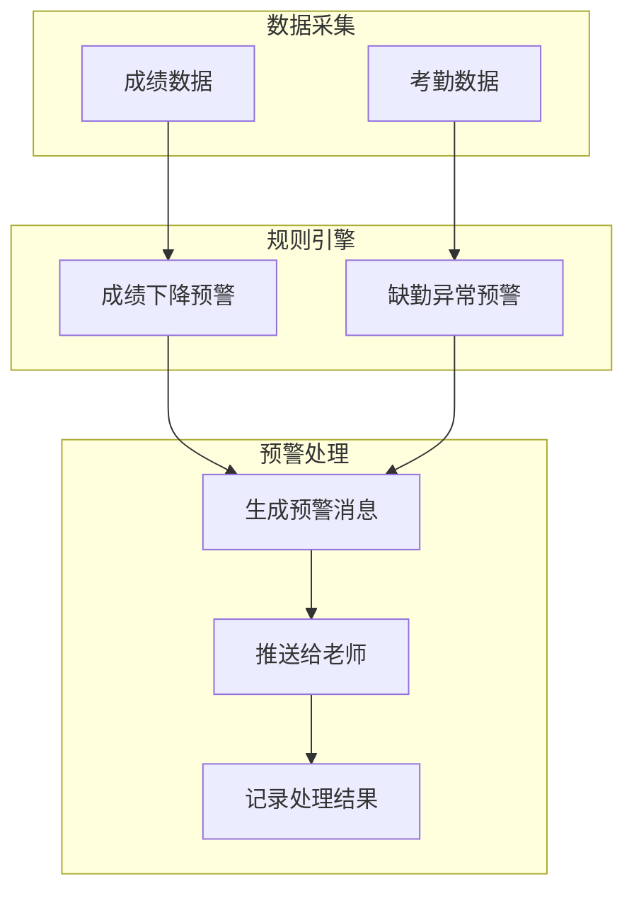

# 学生数据分析系统 - 数据模型设计文档

## 1. 概述

### 1.1 设计目标

本数据模型旨在为中小学教育场景（单校部署）提供一套 AI 驱动的数据分析解决方案，核心目标是：

```
┌─────────────────────────────────────────────────────────────────────────────┐
│                              核心目标                                        │
├─────────────────────────────────────────────────────────────────────────────┤
│                                                                             │
│  🎯 协助老师完成对学生的个性化教育                                            │
│      ├── 精准识别学生长短板                                                  │
│      ├── 智能生成学习建议                                                    │
│      └── 追踪学生成长轨迹                                                    │
│                                                                             │
│  👀 让老师和家长及时掌握学生的教育情况                                         │
│      ├── 多维度学生画像                                                      │
│      ├── 实时成绩动态                                                        │
│      └── 综合素质发展                                                        │
│                                                                             │
│  ⚠️ 及时发现问题，并采用合适的方案                                            │
│      ├── 成绩异常预警                                                        │
│      ├── 考勤异常提醒                                                        │
│      └── 行为问题追踪                                                        │
│                                                                             │
└─────────────────────────────────────────────────────────────────────────────┘
```

### 1.2 目标用户

| 用户角色 | 核心需求 | 使用场景 |
|---------|---------|---------|
| **班主任** | 全面了解班级学生 | 班级管理、家长沟通、期末评语 |
| **学科老师** | 本科成绩分析 | 教学评估、知识点掌握分析 |
| **学校管理** | 全校数据概览 | 教学质量监控、决策支持 |

### 1.3 系统特点

- **AI驱动**：支持自然语言查询，降低使用门槛（核心卖点）
- **多维度分析**：成绩、考勤、行为、综合素质全方位覆盖
- **个性化建议**：基于数据自动生成学习建议
- **预警机制**：及时发现异常情况并提醒

### 1.4 设计原则

- **MVP 优先**：一期聚焦 AI 分析核心链路（成绩 → 知识点 → 画像 → 建议），16 张表
- **聚合表明确标识**：由 fact 数据衍生的聚合/缓存表使用 `agg_` 前缀，区别于主数据维度
- **排名实时计算**：排名类指标通过 QM 窗口函数实时计算，不存储在事实表中
- **PK 统一 BIGINT**：兼顾唯一性、性能和可读性

---

## 2. 整体架构

### 2.1 数据模型分层架构



### 2.2 数据域划分



> 二期/三期新增的域（试卷分析域、作业域、体测艺术域、综合素质域、班级管理域）见版本规划章节。

---

## 3. ER图

### 3.1 一期核心实体关系图



### 3.2 权限模型关系图



### 3.3 成绩分析域关系图



---

## 4. 数据表详细设计

### 4.1 权限组织域

#### 4.1.1 用户表 (dim_user)

| 字段名 | 类型 | 必填 | 说明 |
|--------|------|------|------|
| user_id | BIGINT | 是 | 用户ID，主键 |
| user_name | VARCHAR(50) | 是 | 用户名，唯一 |
| password_hash | VARCHAR(200) | 是 | 密码哈希 |
| user_type | VARCHAR(20) | 是 | 用户类型：admin/teacher |
| teacher_id | BIGINT | 否 | 关联教师ID |
| status | VARCHAR(20) | 是 | 状态：active/inactive |
| last_login_at | TIMESTAMP | 否 | 最后登录时间 |
| created_at | TIMESTAMP | 是 | 创建时间 |

#### 4.1.2 教师表 (dim_teacher)

| 字段名 | 类型 | 必填 | 说明 |
|--------|------|------|------|
| teacher_id | BIGINT | 是 | 教师ID，主键 |
| teacher_no | VARCHAR(20) | 否 | 工号 |
| teacher_name | VARCHAR(50) | 是 | 姓名 |
| gender | CHAR(1) | 否 | 性别：M/F |
| phone | VARCHAR(20) | 否 | 联系电话 |
| created_at | TIMESTAMP | 是 | 创建时间 |

#### 4.1.3 教师任课关系表 (fact_teacher_assignment)

| 字段名 | 类型 | 必填 | 说明 |
|--------|------|------|------|
| assignment_id | BIGINT | 是 | 任课ID，主键 |
| teacher_id | BIGINT | 是 | 教师ID |
| class_id | BIGINT | 是 | 班级ID |
| subject_id | BIGINT | 否 | 科目ID（班主任可为空） |
| is_head_teacher | BOOLEAN | 是 | 是否班主任 |
| semester_id | BIGINT | 是 | 学期ID |
| is_current | BOOLEAN | 是 | 是否当前 |
| created_at | TIMESTAMP | 是 | 创建时间 |

> 移除 `school_year` 字段，学年信息通过 `semester_id` 关联 `dim_semester` 获取。

---

### 4.2 时间域

#### 4.2.1 学期表 (dim_semester)

| 字段名 | 类型 | 必填 | 说明 |
|--------|------|------|------|
| semester_id | BIGINT | 是 | 学期ID，主键 |
| semester_name | VARCHAR(50) | 是 | 学期名称，如"2025-2026学年第一学期" |
| school_year | VARCHAR(20) | 是 | 学年，如"2025-2026" |
| semester_type | VARCHAR(10) | 是 | 学期类型：first/second |
| start_date | DATE | 是 | 开始日期 |
| end_date | DATE | 是 | 结束日期 |
| is_current | BOOLEAN | 是 | 是否当前学期 |
| created_at | TIMESTAMP | 是 | 创建时间 |

#### 4.2.2 日期维度表 (dim_date)

| 字段名 | 类型 | 必填 | 说明 |
|--------|------|------|------|
| date_id | VARCHAR(10) | 是 | 日期ID，主键，格式：2024-01-15 |
| date_value | DATE | 是 | 日期值 |
| year | INT | 是 | 年 |
| month | INT | 是 | 月 |
| day | INT | 是 | 日 |
| week_day | INT | 是 | 周几 1-7 |
| week_of_year | INT | 否 | 年中第几周 |
| semester_id | BIGINT | 否 | 学期ID |
| is_school_day | BOOLEAN | 是 | 是否教学日 |
| created_at | TIMESTAMP | 是 | 创建时间 |

---

### 4.3 学生班级域

#### 4.3.1 学生表 (dim_student)

| 字段名 | 类型 | 必填 | 说明 |
|--------|------|------|------|
| student_id | BIGINT | 是 | 学生ID，主键 |
| student_no | VARCHAR(20) | 否 | 学号 |
| student_name | VARCHAR(50) | 是 | 姓名 |
| gender | CHAR(1) | 否 | 性别：M/F |
| birth_date | DATE | 否 | 出生日期 |
| class_id | BIGINT | 是 | 所属班级ID |
| enroll_date | DATE | 否 | 入学日期 |
| phone | VARCHAR(20) | 否 | 联系电话 |
| student_status | VARCHAR(20) | 是 | 状态：active/graduated/transferred |
| created_at | TIMESTAMP | 是 | 创建时间 |

> 移除低频字段 `address`、`admission_type`、`political_status`、`boarding_status`，按需在二期扩展。

#### 4.3.2 年级表 (dim_grade)

| 字段名 | 类型 | 必填 | 说明 |
|--------|------|------|------|
| grade_id | BIGINT | 是 | 年级ID，主键 |
| grade_name | VARCHAR(50) | 是 | 年级名称 |
| grade_level | INT | 否 | 年级序号：1-6小学，7-9初中 |
| stage | VARCHAR(20) | 是 | 学段：primary/junior |
| created_at | TIMESTAMP | 是 | 创建时间 |

#### 4.3.3 班级表 (dim_class)

| 字段名 | 类型 | 必填 | 说明 |
|--------|------|------|------|
| class_id | BIGINT | 是 | 班级ID，主键 |
| class_name | VARCHAR(50) | 是 | 班级名称 |
| grade_id | BIGINT | 是 | 年级ID |
| classroom | VARCHAR(50) | 否 | 教室 |
| student_count | INT | 否 | 班级人数 |
| created_at | TIMESTAMP | 是 | 创建时间 |

> 移除 `class_type` 字段，单校场景下班级分类需求弱。

---

### 4.4 科目考试域

#### 4.4.1 科目表 (dim_subject)

| 字段名 | 类型 | 必填 | 说明 |
|--------|------|------|------|
| subject_id | BIGINT | 是 | 科目ID，主键 |
| subject_name | VARCHAR(50) | 是 | 科目名称 |
| subject_type | VARCHAR(20) | 是 | 科目类型：main/minor |
| full_score | INT | 是 | 满分，默认100 |
| pass_score | INT | 是 | 及格分，默认60 |
| excellent_score | INT | 是 | 优秀分，默认85 |
| is_exam_subject | BOOLEAN | 是 | 是否考试科目 |
| sort_order | INT | 否 | 排序 |
| created_at | TIMESTAMP | 是 | 创建时间 |

> 移除 `weight` 字段，科目权重是查询模型层的配置，不属于数据模型。

#### 4.4.2 考试表 (dim_exam)

| 字段名 | 类型 | 必填 | 说明 |
|--------|------|------|------|
| exam_id | BIGINT | 是 | 考试ID，主键 |
| exam_name | VARCHAR(100) | 是 | 考试名称 |
| exam_type | VARCHAR(20) | 是 | 考试类型：daily/unit/midterm/final |
| exam_date | DATE | 是 | 考试日期 |
| semester_id | BIGINT | 是 | 学期ID |
| created_at | TIMESTAMP | 是 | 创建时间 |

> 移除 `school_year`、`semester_name` 冗余字段，通过 `semester_id` 关联获取。

#### 4.4.3 知识点表 (dim_knowledge_point)

| 字段名 | 类型 | 必填 | 说明 |
|--------|------|------|------|
| point_id | BIGINT | 是 | 知识点ID，主键 |
| point_code | VARCHAR(50) | 否 | 知识点编码 |
| point_name | VARCHAR(100) | 是 | 知识点名称 |
| subject_id | BIGINT | 是 | 所属科目ID |
| grade_id | BIGINT | 否 | 适用年级ID |
| parent_id | BIGINT | 否 | 父知识点ID |
| point_level | INT | 否 | 层级深度 |
| difficulty | INT | 否 | 难度等级 1-5 |
| importance | INT | 否 | 重要程度 1-5 |
| description | TEXT | 否 | 知识点描述 |
| created_at | TIMESTAMP | 是 | 创建时间 |

#### 4.4.4 知识点闭包表 (knowledge_point_closure)

| 字段名 | 类型 | 必填 | 说明 |
|--------|------|------|------|
| parent_id | BIGINT | 是 | 祖先节点ID，联合主键 |
| point_id | BIGINT | 是 | 后代节点ID，联合主键 |
| distance | INT | 是 | 层级距离，0表示自身 |

> 语义层架构强制要求闭包表，用于支撑知识点层级的任意层级聚合查询。

---

### 4.5 成绩分析域

#### 4.5.1 成绩事实表 (fact_score)

| 字段名 | 类型 | 必填 | 说明 |
|--------|------|------|------|
| score_id | BIGINT | 是 | 成绩ID，主键 |
| student_id | BIGINT | 是 | 学生ID |
| class_id | BIGINT | 是 | 班级ID |
| subject_id | BIGINT | 是 | 科目ID |
| exam_id | BIGINT | 是 | 考试ID |
| score | DECIMAL(5,2) | 是 | 得分 |
| score_level | CHAR(1) | 否 | 成绩等级：A/B/C/D |
| created_at | TIMESTAMP | 是 | 创建时间 |

> **排名不存储**：`rank_in_class`、`rank_in_grade` 通过 QM 度量使用 `RANK() OVER()` 窗口函数实时计算，避免数据过期问题。

> `score_type` 移除，体测/艺术成绩在二期由独立事实表承载。

#### 4.5.2 学生能力画像聚合表 (agg_student_profile)

| 字段名 | 类型 | 必填 | 说明 |
|--------|------|------|------|
| profile_id | BIGINT | 是 | 画像ID，主键 |
| student_id | BIGINT | 是 | 学生ID，唯一 |
| overall_level | VARCHAR(10) | 否 | 综合等级：A/B/C/D |
| score_trend | VARCHAR(20) | 否 | 成绩趋势：rising/stable/declining |
| ai_summary | TEXT | 否 | AI 生成的完整画像（含优劣势分析、学习风格、建议方向） |
| refreshed_at | TIMESTAMP | 否 | 最后刷新时间 |
| created_at | TIMESTAMP | 是 | 创建时间 |

> **设计说明**：
> - 前缀 `agg_` 明确标识这是一张由 fact 数据衍生的聚合/缓存表，非主数据维度。
> - 原设计中 `strength_subjects`、`weakness_subjects`、`strength_points`、`weakness_points` 等多个 JSON 字段合并到 `ai_summary` 中，由 AI 按需生成结构化 JSON，避免字段碎片化。
> - `refreshed_at` 用于判断画像时效性，业务层根据此字段决定是否触发重新生成。

#### 4.5.3 学习建议表 (fact_learning_advice)

| 字段名 | 类型 | 必填 | 说明 |
|--------|------|------|------|
| advice_id | BIGINT | 是 | 建议ID，主键 |
| student_id | BIGINT | 是 | 学生ID |
| subject_id | BIGINT | 否 | 科目ID |
| point_id | BIGINT | 否 | 知识点ID |
| advice_type | VARCHAR(50) | 是 | 建议类型：review/practice/consolidate/extend |
| advice_level | VARCHAR(20) | 是 | 紧急程度：high/medium/low |
| advice_content | TEXT | 是 | 建议内容 |
| generate_type | VARCHAR(20) | 否 | 生成方式：ai/rule |
| status | VARCHAR(20) | 是 | 状态：pending/done/ignored |
| feedback | VARCHAR(500) | 否 | 老师反馈 |
| created_at | TIMESTAMP | 是 | 创建时间 |
| expires_at | TIMESTAMP | 否 | 建议有效期 |

> 移除 `recommended_resources`、`based_on` 低频字段，按需在二期扩展。

---

### 4.6 考勤域

#### 4.6.1 考勤事实表 (fact_attendance)

| 字段名 | 类型 | 必填 | 说明 |
|--------|------|------|------|
| attendance_id | BIGINT | 是 | 考勤ID，主键 |
| student_id | BIGINT | 是 | 学生ID |
| class_id | BIGINT | 是 | 班级ID |
| date_id | VARCHAR(10) | 是 | 日期ID |
| status | VARCHAR(20) | 是 | 状态：present/absent/late/leave_early/sick_leave |
| time_slot | VARCHAR(20) | 否 | 时段：morning/afternoon/evening |
| reason | VARCHAR(200) | 否 | 原因 |
| recorded_by | BIGINT | 否 | 记录人ID |
| created_at | TIMESTAMP | 是 | 创建时间 |

> 移除 `remark` 字段，`reason` 已足够承载说明信息。

---

## 5. 典型业务场景

### 5.1 AI 分析核心链路（一期重点）



**数据来源**：
- fact_score（成绩）→ 排名通过 QM 窗口函数实时计算
- agg_student_profile（AI 画像缓存）
- fact_learning_advice（学习建议）

### 5.2 异常预警机制



**一期预警规则**：

| 预警类型 | 规则 | 数据来源 |
|---------|------|---------|
| 成绩下降 | 连续两次考试排名下降超过10名 | fact_score（QM 窗口函数） |
| 科目薄弱 | 单科成绩低于班级平均分20分以上 | fact_score |
| 缺勤异常 | 连续缺勤超过3天 | fact_attendance |

> 作业异常、行为异常等预警规则在二期/三期引入对应数据表后补充。

---

## 6. 数据权限设计

### 6.1 角色权限矩阵

| 角色 | 数据范围 | 可见学生 | 可见科目 | 可见功能 |
|------|---------|---------|---------|---------|
| admin | 全校 | 全部学生 | 全部科目 | 全部功能 |
| 班主任 | 本班 | 本班学生 | 全部科目 | 本班相关功能 |
| 科任老师 | 任教班级 | 任教班级学生 | 任教科目 | 任教科目相关功能 |

### 6.2 权限过滤实现

基于 fact_teacher_assignment 表实现数据权限过滤：

```sql
-- 班主任权限过滤
WHERE class_id IN (
    SELECT class_id
    FROM fact_teacher_assignment
    WHERE teacher_id = ? AND is_head_teacher = TRUE AND is_current = TRUE
)

-- 科任老师权限过滤
WHERE class_id IN (
    SELECT class_id
    FROM fact_teacher_assignment
    WHERE teacher_id = ? AND subject_id = ? AND is_current = TRUE
)
```

---

## 7. 表清单汇总

### 7.1 一期表清单（16张）

| 序号 | 域 | 表名 | 前缀 | 用途 |
|------|-----|------|------|------|
| 1 | 权限组织 | dim_user | dim | 用户账户 |
| 2 | | dim_teacher | dim | 教师信息 |
| 3 | | fact_teacher_assignment | fact | 任课关系 |
| 4 | 时间 | dim_semester | dim | 学期 |
| 5 | | dim_date | dim | 日期 |
| 6 | 学生班级 | dim_student | dim | 学生信息 |
| 7 | | dim_grade | dim | 年级 |
| 8 | | dim_class | dim | 班级 |
| 9 | 科目考试 | dim_subject | dim | 科目 |
| 10 | | dim_exam | dim | 考试 |
| 11 | | dim_knowledge_point | dim | 知识点 |
| 12 | | knowledge_point_closure | - | 知识点层级闭包 |
| 13 | 成绩分析 | fact_score | fact | 成绩 |
| 14 | | agg_student_profile | agg | 学生AI画像（聚合/缓存） |
| 15 | | fact_learning_advice | fact | 学习建议 |
| 16 | 考勤 | fact_attendance | fact | 考勤 |

### 7.2 命名前缀说明

| 前缀 | 含义 | 数据特征 |
|------|------|---------|
| `dim_` | 维度表 | 主数据，手工维护或系统同步 |
| `fact_` | 事实表 | 业务事件记录，持续增长 |
| `agg_` | 聚合表 | 由 fact 数据衍生计算，定期刷新 |
| 无前缀 | 辅助表 | 闭包表等结构性辅助表 |

---

## 8. 版本规划

### 8.1 一期（MVP）— 16张表

聚焦 **AI 分析核心链路**：成绩 → 知识点 → 画像 → 建议

| 模块 | 表数 | 核心功能 |
|------|------|---------|
| 权限管理 | 3张 | 用户登录、角色权限过滤 |
| 时间维度 | 2张 | 学期管理、日期维度 |
| 学生班级 | 3张 | 学生/年级/班级基础数据 |
| 科目考试 | 4张 | 科目、考试、知识点（含闭包） |
| 成绩分析 | 3张 | 成绩、AI画像、学习建议 |
| 考勤 | 1张 | 考勤记录、缺勤预警 |

### 8.2 二期 — +7张表

引入 **试卷分析 + 作业 + 体测艺术**

| 新增表 | 用途 |
|--------|------|
| fact_paper_analysis | 按知识点的试卷分析 |
| fact_wrong_question | 错题记录与复习管理 |
| dim_homework | 作业维度 |
| fact_homework_submission | 作业提交与批改 |
| dim_pe_test_item | 体测项目维度 |
| fact_pe_test_score | 体测成绩 |
| fact_art_evaluation | 艺术技能评价 |

### 8.3 三期 — +8张表

引入 **综合素质 + 班级管理 + 题库**

| 新增表 | 用途 |
|--------|------|
| dim_question | 题库（含 VECTOR 语义向量） |
| fact_student_reward_punish | 奖惩记录 |
| fact_student_competition | 竞赛获奖 |
| fact_student_position | 班干部职务 |
| fact_student_comment | 学生评语（AI生成） |
| fact_class_evaluation | 班级评比 |
| fact_home_school_communication | 家校沟通 |
| fact_after_school_service | 课后服务 |

**总计：31张表**（一期16 + 二期7 + 三期8）

---

## 9. 附录

### 9.1 字典定义

```javascript
const dicts = {
    gender: {
        M: '男',
        F: '女'
    },
    subject_type: {
        main: '主科',
        minor: '副科'
    },
    exam_type: {
        daily: '日常测验',
        unit: '单元测试',
        midterm: '期中考试',
        final: '期末考试'
    },
    score_level: {
        A: '优秀',
        B: '良好',
        C: '及格',
        D: '不及格'
    },
    attendance_status: {
        present: '出勤',
        absent: '缺勤',
        late: '迟到',
        leave_early: '早退',
        sick_leave: '病假',
        personal_leave: '事假'
    },
    score_trend: {
        rising: '上升',
        stable: '稳定',
        declining: '下降'
    },
    semester_type: {
        first: '第一学期',
        second: '第二学期'
    }
};
```

### 9.2 命名规范

| 类型 | 规范 | 示例 |
|------|------|------|
| 维度表 | `dim_` 前缀 | dim_student |
| 事实表 | `fact_` 前缀 | fact_score |
| 聚合表 | `agg_` 前缀 | agg_student_profile |
| 闭包表 | 无前缀，语义化 | knowledge_point_closure |
| 主键 | 表名单数_id | student_id |
| 外键 | 关联表名单数_id | class_id |
| 时间字段 | `_at` 后缀 | created_at |
| 日期字段 | `_date` 后缀 | exam_date |
| 状态字段 | `_status` 后缀 | student_status |
| 布尔字段 | `is_` 前缀 | is_current |

---

*文档版本：v2.0*
*创建日期：2026-02-12*
*最后更新：2026-02-13*
